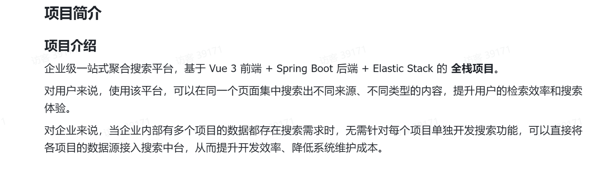

接口文档地址：http://localhost:8102/api/doc.html
聚合搜索项目
项目介绍
    为什么要做？？
      在日常开发搜索中我们针对不同的内容，例如用户，文章，视频，会进行不同的页面展示，到对应的后台进行搜索，但是这样
    搜索对用户体验很不好，而且，针对每个模块开发也不是很方便，所以我们需要一个搜索平台对不同模块进行一个聚合搜索

技术栈：
    前端：Ant Design Vue
    后端：SpringBoot+es

第一拍:
    前后端初始化
    搭建简单的前端页面
    使用url记录页面搜索窗台，当用户刷新页面时，能够从url还原之前的搜索状态

第二拍：
    1，获取多种不同类型的数据源
        a，文章
        b，用户
        c，图片
    2，前后端联调

    
    
